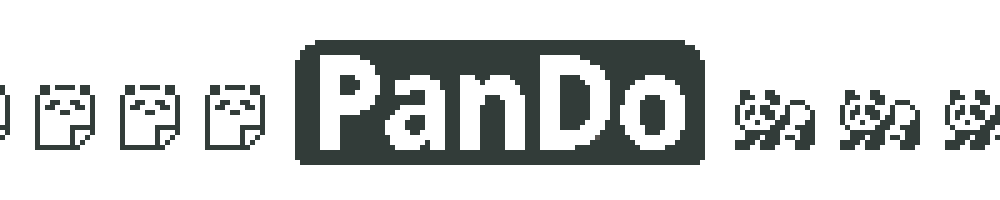
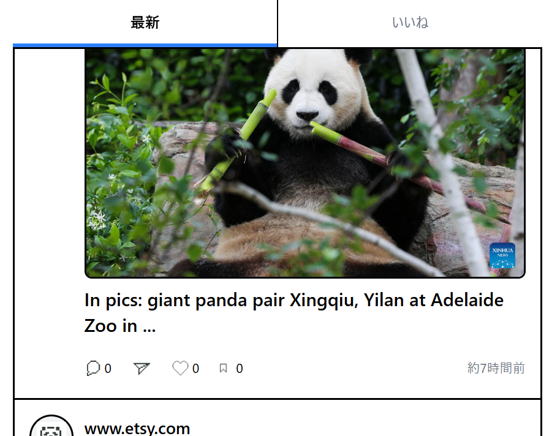
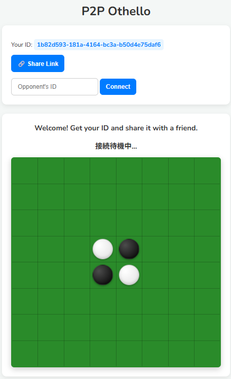

<h1 align="center">👋 Hello, I'm kinn00kinn!</h1>

  
  
  
  

  I'm a student developer from Japan with a passion for coding and a deep appreciation for good coffee ☕. 
  Welcome to my GitHub profile!

  

 

<h2 align="center">🛠️ My Tech Stack</h2>

  
  
  
  
  
   
  
  
  
  
  
   
  
  
  
  
  
   
  
  
  

<h2 align="center">📈 My GitHub Stats</h2>

 
  

<h2 align="center">🚀 Featured Projects</h2>

<h3 align="center">🐼 PanDo</h3>

  <i>A new social media platform specializing in pandas.</i>

  

  

  <b><a href="https://n-scroller.vercel.app/">Visit the Site →</a></b> 
  <b><a href="https://zenn.dev/kinnkinn/articles/622a65a2a76dce">Zenn: 2025 年の個人開発：爆速で「パンダ特化型 SNS」を作った技術スタック全公開</a></b>

<h3 align="center">🎲 P2P Othello</h3>

  <i>Zero Server Costs! A real-time competitive Othello game using only P2P and free services.</i>

  

  <b><a href="https://kinn00kinn.github.io/osero_p2p_front.github.io/">Visit the Site →</a></b> 
  <b><a href="https://zenn.dev/kinnkinn/articles/ff844e4d9e3ce4">Zenn: サーバー代 0 円！ P2P と無料サービスだけでリアルタイム対戦オセロを作った話</a></b>

<h3 align="center">🛠️ More Projects</h3>

<ul align="left">
  <li><b><a href="https://github.com/kinn00kinn/scnz_sh">scnz_sh</a></b>: A bash script to parallelize <code>yt-dlp</code> execution.</li>
  <li><b><a href="https://github.com/kinn00kinn/Ytplaylist2urls">Ytplaylist2urls</a></b>: Extracts all video URLs from a YouTube playlist.</li>
  <li><b><a href="https://github.com/kinn00kinn/statistics-by-awk">statistics-by-awk</a></b>: A statistical processing program written in AWK.</li>
  <li><b><a href="https://github.com/kinn00kinn/Dart_Score_Board">Dart_Score_Board</a></b>: A simple scoreboard for tracking rankings in dart games.</li>
  <li><b><a href="https://github.com/kinn00kinn/CUDA_LBM">CUDA_LBM</a></b>: A program that uses CUDA to execute Lattice Boltzmann Method (LBM) simulations in parallel.</li>
  <li><b><a href="https://github.com/kinn00kinn/img_dlp">img_dlp</a></b>: A Python script that collects images from a website and consolidates them into a single PDF.</li>
  <li><b><a href="https://github.com/kinn00kinn/LUT-Estimator">LUT-Estimator</a></b>: A Python tool that estimates a 3D LUT from image pairs and applies it to other images for high-quality color grading.</li>
  <li><b><a href="https://github.com/kinn00kinn/playlist2urls">playlist2urls</a></b>: A program to extract all video URLs from a YouTube playlist.</li>
  <li><b><a href="https://github.com/kinn00kinn/user-info-viewer.github.io">user-info-viewer</a></b>: A simple web page to display user information from a text file.</li>
  <li><b><a href="https://kinn00kinn.github.io/yt-dlp-server.github.io/">yt-dlp-server</a></b>: A web interface for the powerful <code>yt-dlp</code> tool.
    <ul>
      <li><b>Frontend Repo</b>: <a href="https://github.com/kinn00kinn/yt-dlp-server.github.io">yt-dlp-server.github.io</a></li>
      <li><b>Backend Repo</b>: <a href="https://github.com/kinn00kinn/yt-dl-server">yt-dl-server</a></li>
    </ul>
  </li>
</ul>
