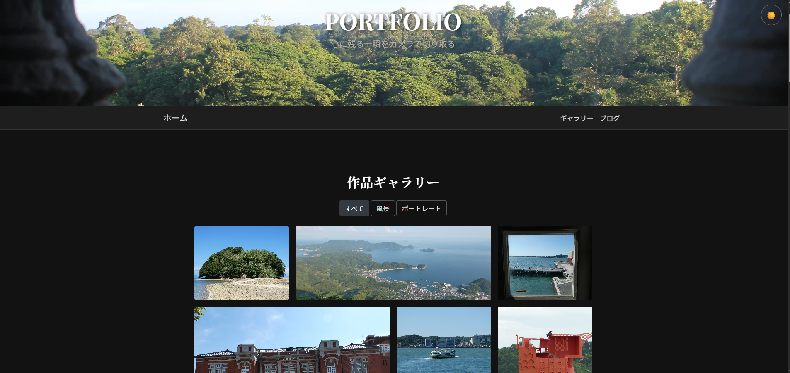

# 👋 Hello, I'm kinn00kinn!

I'm a student developer from Japan with a passion for coding and a deep appreciation for good coffee ☕. Welcome to my GitHub profile!

## 🛠️ My Tech Stack

  
  
  
  
  
  
  
  
  
  
  
  
  
  
  
  
  
  
  
  
  
  

## 📈 My GitHub Stats

 
  
  

## 🚀 Featured Projects

### 🎲 P2P Othello

> Zero Server Costs! A real-time competitive Othello game using only P2P and free services.

This is a real-time Othello game that runs entirely in a browser. It primarily uses P2P communication via **WebRTC (PeerJS)**, allowing game actions between players to be handled directly without a server, thus achieving a low-latency experience. Its key feature is that it can be operated with absolutely no server costs by deploying the signaling server for initial connections on **Render's** free tier and the front-end game client on **GitHub Pages**. You can start a match immediately without any installation just by sending a generated URL to a friend.

**[Visit the Site →](https://kinn00kinn.github.io/osero_p2p_front.github.io/)**

Zenn:[サーバー代0円！ P2Pと無料サービスだけでリアルタイム対戦オセロを作った話](https://zenn.dev/kinnkinn/articles/ff844e4d9e3ce4)

---

### 🎨 Pixel-Sorting-Morphing-Page

> Transform your everyday photos into breathtaking digital art.

This is an interactive tool that allows you to artistically process your images. Using a technique called **pixel sorting**, you can add fantastical effects that look as if paint is melting and flowing. Furthermore, the **morphing feature** lets you generate mesmerizing animations of your images smoothly transforming. All operations are controlled with intuitive sliders, so no expert knowledge is required.

**[Visit the Site →](https://kinn00kinn.github.io/Pixel-Sorting-Morphing-Page.github.io/)**

---

### ⌨️ AncientTech (Chat-style Typing Game)

> Decipher the ancient texts. A chat-style typing challenge.

This is an immersive, chat-style typing game where you must type the on-screen text before it disappears. While simple, it demands both accuracy and speed, making it an addictive challenge.

- **Crisp Sound Effects:** Fun sounds that make typing enjoyable.
- **Skill Improvement:** Enhance your typing skills while having fun.
- **Perfect for a Break:** Ideal for a quick refresh during a short break.

**[Take the Challenge →](https://kinn00kinn.github.io/typing_game.github.io/)**

---

### 📸 My Portfolio

> Where the world through my lens and the expressions woven by code meet.

This site is a gallery showcasing my own photography. At the same time, the site itself is a testament to my programming skills. It's a portfolio that embodies my creativity by fusing the analog sensibility of photography with the digital technology of a website.

**[View Portfolio →](https://kinn00kinn.github.io/)**

---

### 🛠️ More Projects

  - **[scnz\_sh](https://github.com/kinn00kinn/scnz_sh)**: A bash script to parallelize `yt-dlp` execution.
  - **[Ytplaylist2urls](https://github.com/kinn00kinn/Ytplaylist2urls)**: Extracts all video URLs from a YouTube playlist.
  - **[statistics-by-awk](https://github.com/kinn00kinn/statistics-by-awk)**: A statistical processing program written in AWK.
  - **[Dart\_Score\_Board](https://github.com/kinn00kinn/Dart_Score_Board)**: A simple scoreboard for tracking rankings in dart games.
  - **[CUDA\_LBM](https://github.com/kinn00kinn/CUDA_LBM)**: A program that uses CUDA to execute Lattice Boltzmann Method (LBM) simulations in parallel.
  - **[img\_dlp](https://github.com/kinn00kinn/img_dlp)**: A Python script that collects images from a website and consolidates them into a single PDF.
  - **[LUT-Estimator](https://github.com/kinn00kinn/LUT-Estimator)**: A Python tool that estimates a 3D LUT from image pairs and applies it to other images for high-quality color grading.
  - **[playlist2urls](https://github.com/kinn00kinn/playlist2urls)**: A program to extract all video URLs from a YouTube playlist.
  - **[user-info-viewer](https://github.com/kinn00kinn/user-info-viewer.github.io)**: A simple web page to display user information from a text file.
  - **[yt-dlp-server](https://kinn00kinn.github.io/yt-dlp-server.github.io/)**: A web interface for the powerful `yt-dlp` tool.
      - **Frontend Repo**: [`yt-dlp-server.github.io`](https://www.google.com/search?q=%5Bhttps://github.com/kinn00kinn/yt-dlp-server.github.io%5D\(https://github.com/kinn00kinn/yt-dlp-server.github.io\))
      - **Backend Repo**: [`yt-dl-server`](https://www.google.com/search?q=%5Bhttps://github.com/kinn00kinn/yt-dl-server%5D\(https://github.com/kinn00kinn/yt-dl-server\))
